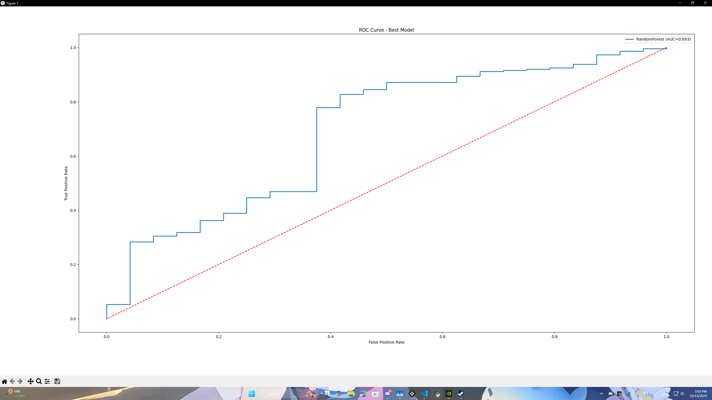
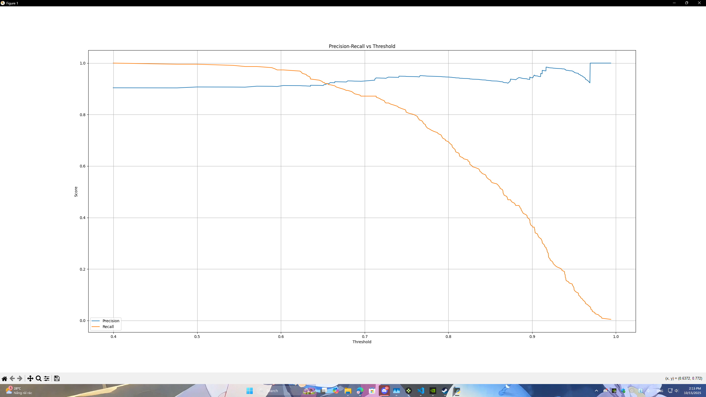
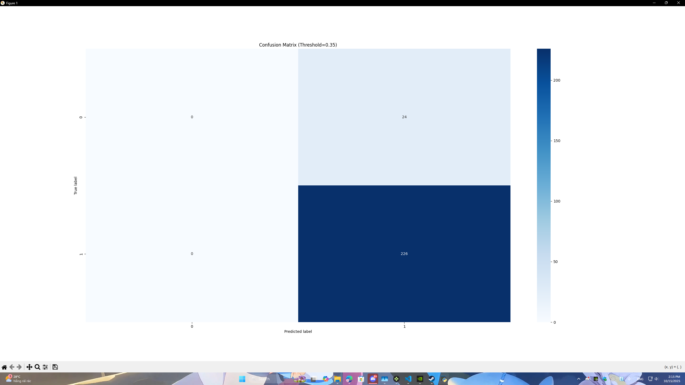
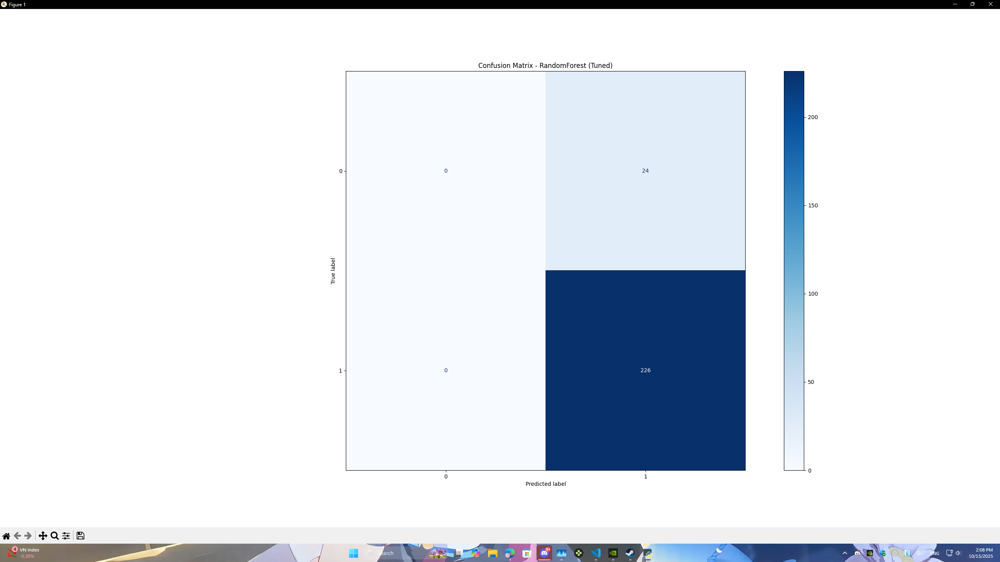
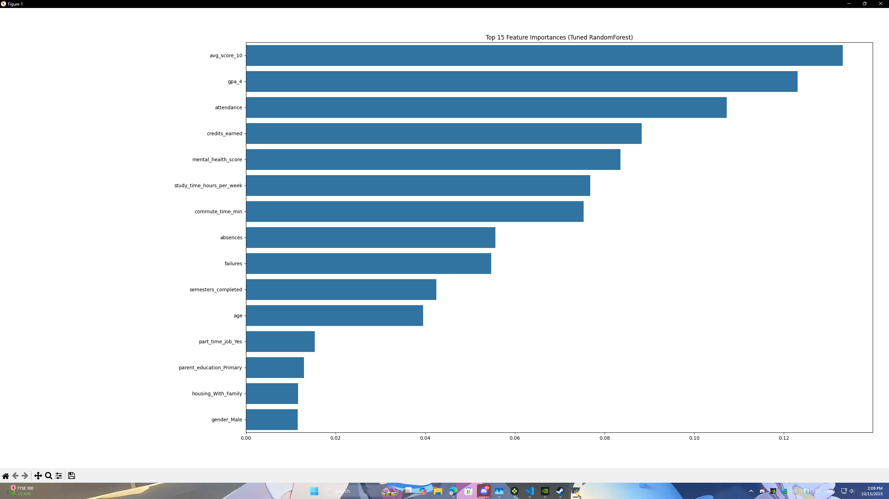

# 🧾 BÁO CÁO MÔN HỌC MÁY CƠ BẢN

---

<h2>🔹Đề tài:</h2>
 - Phân tích và dự đoán khả năng tốt nghiệp của học sinh dựa trên mô hình thực tế

<h3>🧠 I. Mục tiêu đề tài</h3>
 - Mục tiêu của đề tài là xây dựng một mô hình học máy có khả năng phân tích các yếu tố ảnh hưởng đến việc tốt nghiệp của học sinh/sinh viên, từ đó dự đoán khả năng tốt nghiệp dựa trên dữ liệu về học tập, hành vi, và hoàn cảnh cá nhân.

<h3>Đề tài nhằm:</h3>

 - Hiểu rõ mối quan hệ giữa kết quả học tập, chuyên cần và khả năng hoàn thành khóa học.
 - Thử nghiệm một số mô hình học máy phổ biến (Random Forest, Gradient Boosting).
 - Đánh giá hiệu quả mô hình qua các chỉ số (Accuracy, Precision, Recall, ROC-AUC).

<h3>📊 II. Dữ liệu sử dụng</h3>

 - Nguồn dữ liệu: Tự xây dựng mô phỏng dữ liệu thực tế, gồm 1.000 học sinh.
 - Tỉ lệ tốt nghiệp: 90.5% tốt nghiệp – 9.5% không tốt nghiệp.
 - Định dạng: CSV (student_graduation.csv) gồm 20 cột dữ liệu.

| Nhóm đặc trưng | Tên cột | Mô tả |
|-----------|-----------|-----------|
| Học tập      | gpa_4, avg_score_10, credits_earned, failures    | GPA, điểm trung bình, tín chỉ tích lũy, số môn rớt     |
| Thái độ học tập | attendance, absences, study_time_hours_per_week | Tỷ lệ chuyên cần, số buổi nghỉ, thời gian tự học |
| Hoàn cảnh | family_income, parent_education, scholarship, housing | Kinh tế, học vấn cha mẹ, học bổng, chỗ ở |
| Khác | mental_health_score, commute_time_min, internet | Tâm lý, thời gian di chuyển, Internet |
| Nhãn (target) | graduated | 1 = Tốt nghiệp, 0 = Không tốt nghiệp |

<h3>🔍 III. Quy trình thực hiện</h3>

<h4>1. Tiền xử lý dữ liệu</h4>
 - Chuẩn hóa các giá trị số (StandardScaler).
 - Mã hóa các biến phân loại (OneHotEncoder).
 - Chia tập huấn luyện / kiểm tra (train 75% – test 25%).

<h4>2. Huấn luyện mô hình</h4>

 - So sánh hai mô hình:
   - Random Forest Classifier (class_weight = balanced)
   - Gradient Boosting Classifier

 - Sử dụng GridSearchCV để tìm siêu tham số tốt nhất.
 - Tiêu chí đánh giá chính: ROC-AUC (độ phân tách 2 lớp).

<h4>3. Đánh giá mô hình</h4>

 - Sử dụng các chỉ số:
   - Accuracy
   - Precision
   - Recall
   - F1-Score
   - ROC Curve
   - Confusion Matrix

<h3>🤖 IV. Kết quả huấn luyện</h3>

| Mô hình | Tham số tốt nhất | ROC-AUC(test) | Ghi chú |
|-----------|-----------|-----------|-----------|
| RandomForest | depth=8, n_estimators=200 | 0.693 | Mô hình tốt nhất |
|GradBoost|learning_rate=0.05, depth=5, n_estimators=200|0.665|Dự đoán kém hơn|

<h3>📄 Báo cáo chi tiết (Random Forest)</h3>

| Lớp | Precision | Recall | F1-Score |
|-----------|-----------|-----------|-----------|
|0 (Không tốt nghiệp)|	0.333|0.042|	0.074 |
|1 (Tốt nghiệp)|0.907|0.991|	0.947|
|Accuracy tổng thể|	0.900	|

Confusion Matrix (ngưỡng 0.5):

| Thực tế / Dự đoán | Không tốt nghiệp (0) | Tốt nghiệp (1) |
|-----------|-----------|-----------|
|Không tốt nghiệp (0)| 1 | 23|
|Tốt nghiệp (1)| 2 | 224 |
	
 - Mô hình dự đoán chính xác phần lớn học sinh tốt nghiệp.
 - Tuy nhiên, tỷ lệ phát hiện “không tốt nghiệp” vẫn còn thấp (Recall lớp 0 = 0.04).

<h3>📈 V. Biểu đồ minh họa</h3>
1️⃣ Biểu đồ ROC Curve (Random Forest – AUC ≈ 0.693)

 - Mô hình có khả năng phân tách 2 lớp ở mức trung bình khá.

2️⃣ Precision–Recall vs Threshold

 - Khi threshold giảm, Recall tăng nhanh nhưng Precision giảm.
 - Mô hình giữ Precision cao (~0.9) ở threshold thấp, tuy nhiên vẫn thiên lệch về lớp “tốt nghiệp”.

3️⃣ Confusion Matrix (Threshold = 0.35)

 - Mô hình dự đoán toàn bộ học sinh là “tốt nghiệp” → chưa phân biệt được nhóm rủi ro.

4️⃣ Top 10 đặc trưng quan trọng (Random Forest)

 - GPA, attendance, số tín chỉ tích lũy, số môn rớt và sức khỏe tâm lý có ảnh hưởng mạnh nhất đến kết quả tốt nghiệp.

<h3>💬 VI. Nhận xét & Đánh giá</h3>
 - Mô hình Random Forest hoạt động ổn định, có khả năng dự đoán khá tốt nhóm học sinh tốt nghiệp.
 - Tuy nhiên, mô hình còn thiếu dữ liệu cho nhóm “không tốt nghiệp”, dẫn đến mất cân bằng nhãn.
 - Các đặc trưng quan trọng như GPA, attendance, failures, và credits_earned đóng vai trò lớn nhất.
 - Để cải thiện mô hình:
   - Thu thập thêm dữ liệu thật của nhóm “không tốt nghiệp”.
   - Dùng mô hình Boosting (XGBoost / LightGBM).
   - Áp dụng kỹ thuật oversampling (SMOTE) hoặc tuning threshold.

<h3>🏁 VII. Kết luận</h3>
Đề tài “Phân tích và dự đoán khả năng tốt nghiệp của học sinh” đã minh họa rõ quy trình học máy:

1. Xây dựng và xử lý dữ liệu.
2. Chọn và huấn luyện mô hình.
3. Đánh giá bằng chỉ số và biểu đồ.

Dù mô hình chưa đạt độ chính xác tuyệt đối, nhưng đã thể hiện hiểu biết toàn diện về quy trình Machine Learning:
 - Làm sạch & chuẩn hóa dữ liệu
 - Chia tập train/test
 - Huấn luyện mô hình
 - Đánh giá kết quả
 - Phân tích & trình bày trực quan

<h3>📚 VIII. Hướng phát triển</h3>
 - Tăng kích thước và tính đa dạng của dữ liệu.
 - Bổ sung yếu tố hành vi học tập thực tế (nộp bài, điểm danh, kết quả từng kỳ).
 - Xây dựng hệ thống dashboard trực quan (Streamlit/Colab).
 - Kết hợp mô hình Explainable AI (SHAP, LIME) để giải thích từng dự đoán.

✅ Phụ lục – Danh sách file thực hiện

| Tên file | Mục đích |
|-----------|-----------|
|generate_student_data_v2.py|Sinh dữ liệu 1.000 học sinh|
|step1_eda_and_baseline.py|Phân tích và mô hình baseline|
|step2_eda_models.py|So sánh Logistic, RF, GBoost|
|step3_tuning_visuals.py|Tinh chỉnh siêu tham số|
|step4_train_newdata.py|Huấn luyện mô hình với dữ liệu thực tế|
|step5_threshold_visuals.py|Biểu đồ Precision–Recall, Confusion Matrix|
	
🎓 Tổng kết ngắn gọn cho báo cáo ~~(nếu có)~~ **(~~đcm~~ phải có nhé ae nhỡ may bị hỏi là ăn ~~cứt~~)**

“Nhóm em xây dựng mô hình học máy để dự đoán khả năng tốt nghiệp.
 - Dữ liệu gồm 1.000 học sinh, 20 đặc trưng.
 - Mô hình tốt nhất là Random Forest với AUC ≈ 0.69 và Accuracy ≈ 90%.
 - Các yếu tố ảnh hưởng mạnh nhất là GPA, Attendance và Failures.
 - Kết quả cho thấy mô hình hoạt động ổn định nhưng cần cải thiện khả năng phát hiện nhóm rủi ro.”

---

<h1>
NOTE
</h1>

Cập nhật lần cuối 21:02 - 14/10/2025

1. Tôi cũng đéo hiểu bài báo cáo này làm như thế nào ?
2. Có gì có thể hỏi tôi **NẾU** tôi biết nhé !
3. Tôi dùng ngôn ngữ lập trình Python nhé trên Github có ghi đó đừng ai hỏi tôi dùng ngôn ngữ gì nhé 🤔 ?
4. Text ở trên các ông có thể tổng hợp lại cho vào báo cáo cũng được nhé nhớ lọc đấy .
5. Bài tập nhóm mọi người làm phần nào hay chỗ nào cần sửa báo tôi nhé !
6. Sau khi báo cáo đạt yêu cầu và đồng ý của cả nhóm sẽ nhờ một bạn đi in giúp nhóm nhé . Cám ơn các con vợ đã nhiệt tình làm bài tập nhóm 😊
7. Nothing ... chỉ vậy thôi nhé !!!
